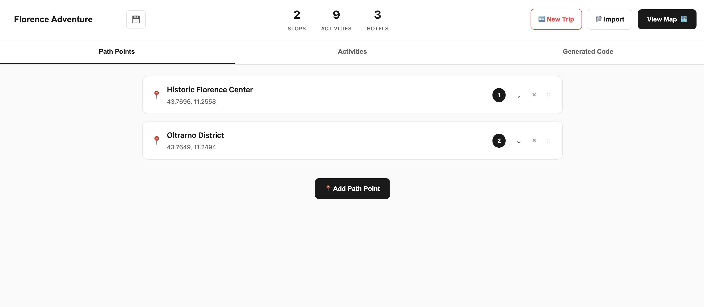
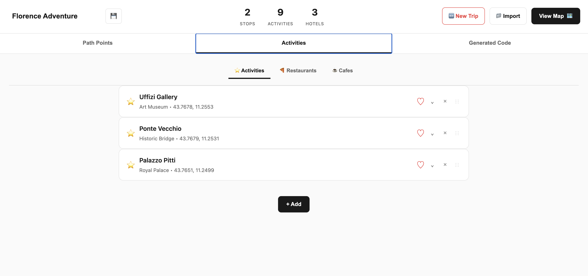
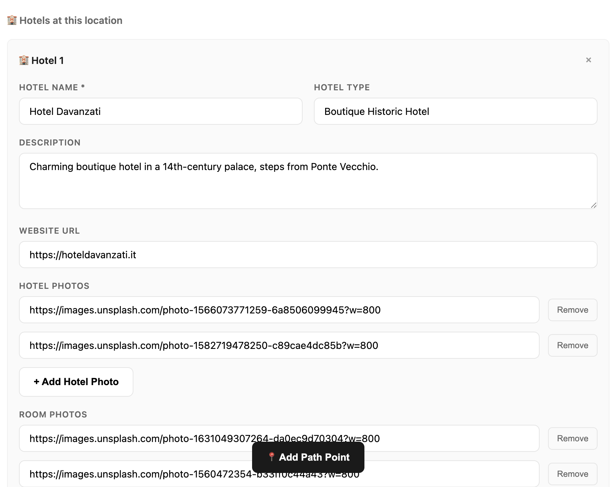
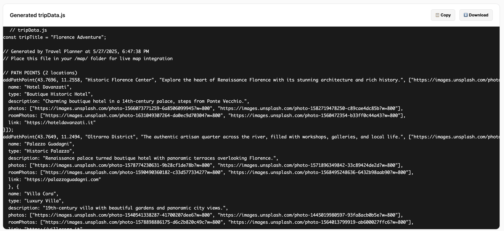

# Basic Travel Planner

**Basic Travel Planner** is a modular, self-hosted **trip planning and visualization system** for building interactive, multi-stop travel maps. Built entirely with Leaflet.js and vanilla JavaScript, it now includes both a full-featured **Planner UI** and a clean **Viewer UI**, offering a seamless way to create, preview, and share detailed itineraries — all without a database or server.

Whether you're a creator crafting a trip journal, a traveler organizing an adventure, or a developer prototyping ideas, this planner offers complete flexibility, privacy, and portability.

This project aims to offer an elegant alternative to bloated, ad-ridden, or paywalled travel planning tools. With it, you can:

- Highlight cities and must-see locations
- Showcase restaurants, cafes, activities, and hotels
- Visually plan routes and stages
- Present immersive, image-rich trip previews

Whether you're crafting a travel journal, pitching a trip idea, or building a personal trip site, this planner is adaptable, extendable, and fully offline-capable.

---

## Table of Contents

* [Live Demos](#live-demos)
* [Features](#features)
* [Features](#Planner-vs-Viewer)
* [Getting Started](#getting-started)
* [Customize Your Trip](#customize-your-trip)
* [Tech Stack](#tech-stack)
* [Project Structure](#project-structure)
* [Changelog](#changelog)
* [License](#license)

---

## Screenshots

### 🛠 Planner UI

Design your trip with tabs for path points, activities, and cafes. Input photos, locations, and organize your stops visually.





---

### 📄 Generated Code Preview

Instantly export your full trip as a shareable or deployable `tripData.js` file.



---

### 🗺️ Trip Viewer (Map Mode)

Display your finished trip on a clean, interactive Leaflet.js map with filter toggles, zoom visibility, and overlay carousels.


## Live Demos

* **EZ Travel Planner:** [github.com/Oceanpro00/a\_basic\_travel\_planner](https://oceanpro00.github.io/a_basic_travel_planner/ez_travel_planner/)
* **Tuscany Trip Example:** [View Planner](https://oceanpro00.github.io/a_basic_travel_planner/tuscany/)
* **Minimal Starter Version:** [View Basic Example](https://oceanpro00.github.io/a_basic_travel_planner/example/)
* **GitHub Repo:** [github.com/Oceanpro00/a\_basic\_travel\_planner](https://github.com/Oceanpro00/a_basic_travel_planner)

---

## Features

* 💻 Fully client-side: no backend, no database
* 🗺️ Built with Leaflet.js and custom modular JavaScript
* ✨ Now includes two UIs:
  - **Planner UI** for drag-and-drop itinerary building
  - **Viewer UI** for clean, interactive trip previews
* 📍 Clickable markers for path points, activities, food, must-dos, and cafes
* 🧭 Auto-centering map with zoom-level filtering
* 🎨 Side panel overlays with:
  - Image carousels (room vs. exterior toggle for hotels)
  - Keyword tags auto-generated from description/type
  - Smart handling of broken/missing images
* 📱 Mobile-optimized layout and touch interaction
* 🧩 Visual map legend with individual marker filters (⭐ / ❤️ / 🍕 / ☕)

Use this planner to:
- Share personalized itineraries with friends or clients
- Build regional trip guides or travel journals
- Prototype ideas for editorial or content workflows

---

## Planner vs Viewer

This project now supports two complementary interfaces:

### 🛠️ Planner UI
Accessible at `/docs/ez_travel_planner/`, the Planner UI is an input-driven trip builder that allows for:

- Adding and editing markers (Path Points, Must-Dos, Activities, Food, Cafes) through a guided form interface
- Reordering stops using a drag-and-drop UI
- Instantly previewing all changes on the live map
- Generating the final `tripData.js` code dynamically—no manual coding required

Perfect for creators who want structure, flexibility, and real-time visualization without editing raw JavaScript.

### 🌍 Viewer UI
Used for polished trip presentation and sharing:

- Reads from a pre-generated `tripData.js` file
- Displays a clean, interactive itinerary with overlays and images
- Supports hotel photo toggles, activity filtering, mobile responsiveness, and smooth animations

Use the **Planner UI** to build and customize your trip, then publish it using the **Viewer UI** for a seamless, offline-capable experience.

---

## Getting Started

You can start building your trip in two ways, depending on your preference:

### 🛠️ Option 1: Use the Planner UI (Recommended)

1. Open `/docs/ez_travel_planner/index.html` in your browser.
2. Add markers through the input interface: Path Points, Must-Dos, Activities, Food, and Cafes.
3. Reorder trip stages using drag-and-drop.
4. Instantly preview your changes on the live map.
5. When ready, copy the auto-generated code block for `tripData.js`.
6. Paste this into your preferred Viewer folder (e.g. `/docs/tuscany/tripData.js`) for publishing.

This interface is best for creators who want to avoid manual code editing and see real-time map updates as they plan.

---

### 💻 Option 2: Manual Setup (For Developers)

1. Clone or fork the repository.
2. Navigate to your desired Viewer folder (e.g. `/docs/tuscany/`) and open `tripData.js`.
3. Add locations using:
   - `addPathPoint()`
   - `addMustDo()`
   - `addActivity()`
   - `addFood()`
   - `addCafe()`
4. Open the corresponding `index.html` in your browser or deploy the folder using GitHub Pages.
5. Customize the `tripTitle` variable to update the page title.

---

## Customize Your Trip

All trip content is stored in a single `tripData.js` file.

You can:

- Use direct URLs or locally stored images from the `/assets` folder
- Include hotel listings with separate exterior and room photo sets
- Add optional links, tags, and descriptions for each marker
- Customize the entire visual style via `styles.css` in each folder
- Choose between multiple Viewer templates (e.g. `tuscany`, `example`) to suit your layout or theme

📘 Full documentation available: [`basic_travel_planner_cheatsheet.md`](./docs/tuscany/basic_travel_planner_cheatsheet.md)

---

## Build Notes

This project was developed through iterative prototyping and AI-supported collaboration. It blends automation with handcrafted logic to offer a smooth user experience across devices.

* **Claude AI** (Anthropic) was used to scaffold early logic and generate UI patterns
* **ChatGPT** helped rapidly iterate, debug, and explore refactors
* **Custom implementation** handled interaction logic, UX polish, marker handling, and mobile responsiveness

The result is a lightweight planner that can be easily customized or extended, serving as both a technical portfolio piece and a base for future travel tools.

---

## Tech Stack

* HTML + CSS + JavaScript (no frameworks)
* Leaflet.js for map rendering
* Hosted via GitHub Pages

---

## Project Structure

```
CHANGELOG.md # Changelog (detailed updates)
README.md # Main documentation

/docs
├── ez_travel_planner/ # Main planner + viewer system
│ ├── index.html # Drag-and-drop Planner UI
│ ├── styles.css
│ └── js/
│ ├── core-app.js # Main app initialization
│ ├── item-creators.js # Marker creation (addActivity, addMustDo, etc.)
│ ├── code-generator.js # Auto-generates tripData code
│ ├── drag-drop.js # Handles draggable element creation and interaction
│ ├── ui-helpers.js # Utility classes for UI states and toggles
│ └── data-manager.js # JSON restoration, data merging
├── ez_travel_planner/map/ # Viewer UI with map only
│ ├── index.html
│ ├── styles.css
│ ├── script.js # Viewer-specific logic
│ ├── tripData.js # Main trip data file (to be generated or edited)
│ └── live-reader.js # Pulls live JSON from input field
├── tuscany/ # Example trip demo: Tuscany
├── example/ # Minimal starter template
```

Set GitHub Pages to deploy from the `/docs` folder.

---

## Update

### v0.5.0 – May 27, 2025

- Modular restructure: clear separation between the Planner (editor) and Viewer (presentation) interfaces
- New input-based trip creation system with live map previews and drag-and-drop reordering
- Minimalist Viewer UI for read-only itineraries using either localStorage or a static tripData.js
- Added fallback logic for broken or missing image URLs in the carousel
- Enhanced mobile responsiveness and smoother overlay transitions
- Updated live-reader.js to support real-time map updates directly from the Planner
- Visual and structural improvements to documentation and sample deployment folders (`/example/`, `/tuscany/`, `/map/`)
- All screenshots and illustrations in the README updated to reflect the current UI

---

## Future Roadmap

This project is designed to remain flexible, simple, and browser-based. Planned improvements include:

- A more visual editor experience with block-style inputs and collapsible sections
- AI-assisted itinerary generation based on entered locations or regions
- Optional calendar-based trip planning features (start and end dates, daily breakdowns)
- Support for theme customization (dark mode, destination-based designs)
- One-click export to shareable links, zipped trip folders, or PDF print formats

Feedback, forks, and suggestions are always welcome.

---

## License

This project was built independently with the help of Claude AI and ChatGPT, alongside custom logic and manual iteration. It is open-source and shared for demonstration and inspiration purposes.

All rights to commercial use are reserved by the original creator. You may fork, adapt, or explore the project for learning or personal experimentation, but **you may not use it commercially or redistribute it** without written permission.
