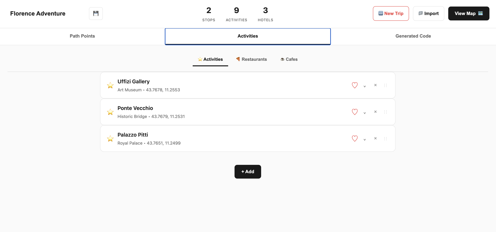
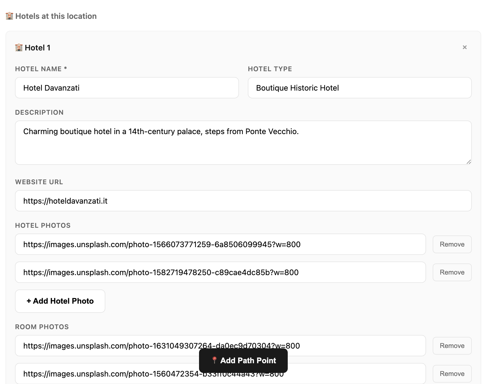
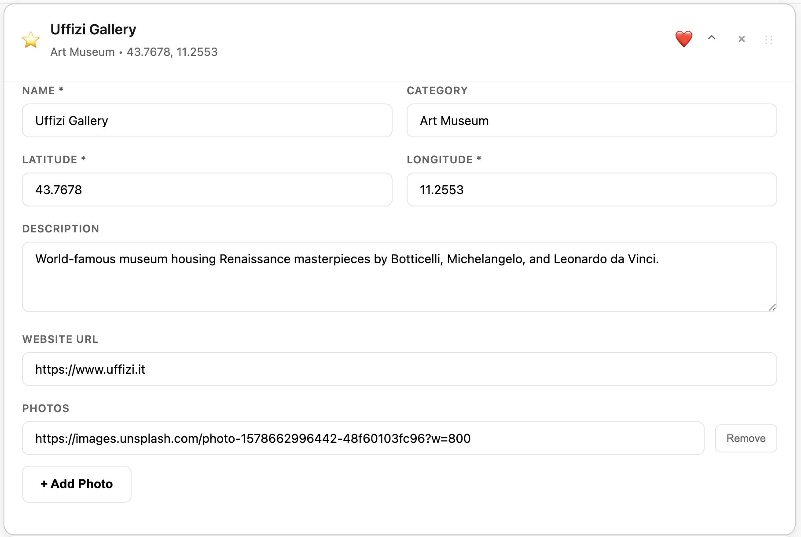
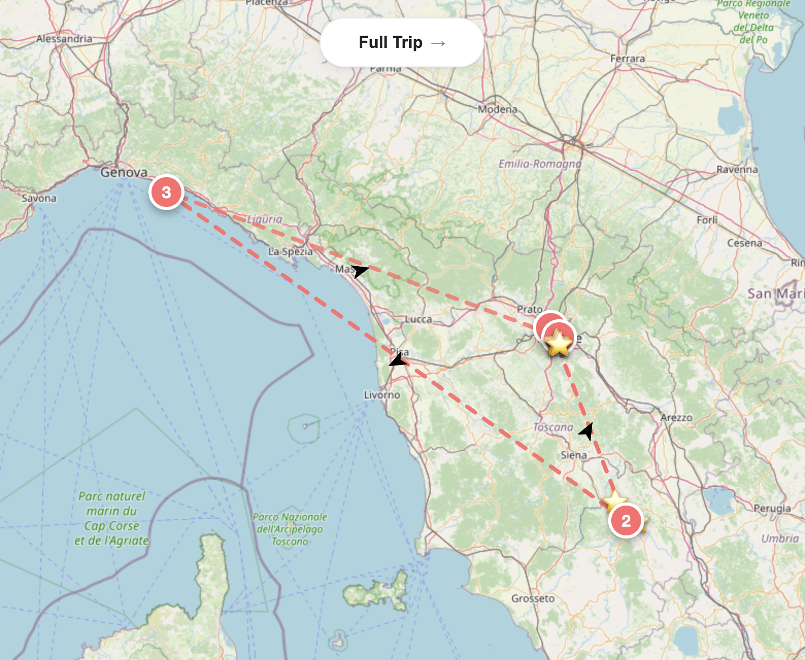

# Basic Travel Planner

**Basic Travel Planner** is a modular, self-hosted **trip planning and visualization system** for building interactive, multi-stop travel maps. Built entirely with Leaflet.js and vanilla JavaScript, it now includes both a full-featured **Planner UI** and a clean **Viewer UI**, offering a seamless way to create, preview, and share detailed itineraries — all without a database or server.

Whether you're a creator crafting a trip journal, a traveler organizing an adventure, or a developer prototyping ideas, this planner offers complete flexibility, privacy, and portability.

This project aims to offer an elegant alternative to bloated, ad-ridden, or paywalled travel planning tools. With it, you can:

- Highlight cities and must-see locations
- Showcase restaurants, cafes, activities, and hotels
- Visually plan routes and stages
- Present immersive, image-rich trip previews

Whether you're crafting a travel journal, pitching a trip idea, or building a personal trip site, this planner is adaptable, extendable, and fully offline-capable.

**🎯 Portfolio Landing Page:** [View Live Demo](https://oceanpro00.github.io/a_basic_travel_planner/)

---

## Table of Contents

* [Live Demos](#live-demos)
* [Project Versions](#project-versions)
* [Screenshots](#screenshots)
* [Features](#features)
* [Getting Started](#getting-started)
* [Project Structure](#project-structure)
* [Customize Your Trip](#customize-your-trip)
* [Tech Stack](#tech-stack)
* [Deployment Options](#deployment-options)
* [Build Notes](#build-notes)
* [Changelog](#changelog)
* [Future Roadmap](#future-roadmap)
* [Contributing](#contributing)
* [License](#license)

---

## Live Demos

* **🌐 Portfolio Landing:** [View All Versions](https://oceanpro00.github.io/a_basic_travel_planner/)
* **🗺️ v0.1 Static Viewer:** [Tuscany Demo](https://oceanpro00.github.io/a_basic_travel_planner/versions/v0.1_manual_map/tuscany/)
* **🛠️ v0.2 Interactive Planner:** [Launch Planner](https://oceanpro00.github.io/a_basic_travel_planner/versions/v0.2_manual_planner/)
* **📂 GitHub Repository:** [github.com/Oceanpro00/a_basic_travel_planner](https://github.com/Oceanpro00/a_basic_travel_planner)

---

## Project Versions

This project is now organized into distinct versions, each serving different use cases and complexity levels:

### 🗺️ v0.1 – Static Map Viewer
**Location:** `/docs/versions/v0.1_manual_map/`

A read-only map display where trip data is pre-configured in `tripData.js`. Perfect for showcasing completed itineraries or embedding finished maps into websites and blogs.

**✅ Best for:**
- Developers who want maximum control and customization
- Static deployments where trip data rarely changes
- Projects requiring multiple trip variations (easy to swap tripData.js files)
- Lightweight embedding in existing web applications
- Situations where you need predictable, minimal code footprint

**❌ Limitations:**
- Requires coding knowledge to set up and modify
- No user interface for editing trip data
- Manual process for adding or changing locations

**Available Templates:**
- [**Tuscany Trip Example**](https://oceanpro00.github.io/a_basic_travel_planner/versions/v0.1_manual_map/tuscany/) - Complete trip with hotels, restaurants, and activities
- [**Empty Template**](https://oceanpro00.github.io/a_basic_travel_planner/versions/v0.1_manual_map/empty_template/) - Minimal starter for building your own trip

**Features:**
- Responsive map with custom markers
- Photo carousels and location details
- Mobile-optimized overlays
- Zero dependencies beyond Leaflet.js

### 🛠️ v0.2 – Interactive Manual Planner  
**Location:** `/docs/versions/v0.2_manual_planner/`

Full-featured browser-based planner with drag-and-drop interface. Build custom trips, reorder stops, and preview changes in real-time on an embedded map.

**✅ Best for:**
- Users who want to build trip maps but can't/won't write code
- People who prefer form-based input over editing JavaScript files
- Learning how trip data structures work through a visual interface
- Situations where you want to see map changes immediately as you build
- Users who need the safety net of a UI rather than raw code editing

**❌ Limitations:**
- Tedious one-by-one input process (slower than bulk coding)
- Manual location entry only (no autocomplete or search)
- Limited to browser storage for persistence
- More time-consuming than having AI generate a tripData.js file

**Access Points:**
- [**Launch Full Planner**](https://oceanpro00.github.io/a_basic_travel_planner/versions/v0.2_manual_planner/) - Complete planning interface
- [**Map Viewer Only**](https://oceanpro00.github.io/a_basic_travel_planner/versions/v0.2_manual_planner/map/) - Display-only map for presentations

**Planning Workflow:**
1. Add trip elements using the tabbed interface
2. Include photos, descriptions, and location details
3. Organize stops with drag-and-drop reordering
4. Preview your complete trip on the live map
5. Export generated code for deployment

---

## Screenshots

### 🛠 Interactive Planner Interface

The drag-and-drop planning interface allows you to build trips visually while seeing real-time updates on the map.


*Main planning interface with path point creation*


*Activities tab showing marker creation and organization*


*Hotel details input with photo management*


*Must-do activity creation with rich metadata*

### 📄 Code Generation & Export

The planner automatically generates clean, deployable code that you can download and use in any static hosting environment.


*Auto-generated tripData.js code with download functionality*

### 🗺️ Interactive Map Display

Rich, interactive maps with detailed overlays, photo carousels, and mobile-optimized interfaces.


*Complete trip map with markers, routes, and filtering*


*Detailed location overlay with photos and information*


*Route visualization with multiple stops and categories*

---

## Features

### 🎯 Core Functionality

* **💻 Fully Client-Side:** No backend, database, or server required
* **🗺️ Interactive Mapping:** Built with Leaflet.js and custom JavaScript modules
* **✨ Dual Interface Design:** 
  - **Static Viewer** for showcasing completed trips
  - **Interactive Planner** for building and organizing itineraries
* **📍 Rich Marker System:** Support for path points, activities, restaurants, cafes, and hotels
* **🧭 Smart Map Features:** Auto-centering, zoom-based filtering, and responsive controls

### 🎨 User Experience

* **📱 Mobile-First Design:** Optimized for planning and viewing on any device
* **🖼️ Media-Rich Overlays:**
  - Image carousels with room vs. exterior photo toggles
  - Automatic keyword tag generation
  - Graceful handling of broken or missing images
  - Expandable detail panels with smooth animations
* **🧩 Visual Organization:** 
  - Interactive legend with individual marker type filters (⭐ / ❤️ / 🍕 / ☕)
  - Color-coded categories and intuitive iconography
  - Drag-and-drop trip organization

### ⚙️ Technical Features

* **🔄 Real-Time Updates:** Live map synchronization during planning
* **💾 Local Persistence:** Automatic session saving and recovery using browser LocalStorage
* **📦 Export Capabilities:** Generate deployable code bundles
* **🚀 Lightweight Design:** Minimal dependencies, fast-loading
* **🌐 Offline Support:** Works without internet connection once initially loaded

### 🎯 Use Cases

**v0.1 Static Viewer:**
- Developers building travel-related websites who need embeddable maps
- Projects requiring multiple trip variations (simple to swap data files)
- Minimal-dependency applications where you control the entire stack
- Educational projects demonstrating mapping concepts

**v0.2 Interactive Planner:**
- Users who can't or won't edit JavaScript files directly
- Learning trip data structures through guided form input
- Situations where you want immediate visual feedback while building
- Users who prefer the safety of forms over raw code (despite being slower)

---

## Getting Started

Choose your preferred approach based on your technical comfort level and project scope:

### 🛠️ Option 1: Interactive Planner (For Non-Coders)

**Perfect for:** People who want to build trip maps but aren't comfortable editing JavaScript files.

1. **Launch the Planner:** Visit [v0.2 Interactive Planner](https://oceanpro00.github.io/a_basic_travel_planner/versions/v0.2_manual_planner/)

2. **Plan Your Trip:**
   - **Add Path Points:** Create your main route with numbered stops
   - **Include Activities:** Add must-see attractions, activities, and experiences
   - **Mark Restaurants:** Include dining recommendations with photos and details
   - **Add Hotels:** Include accommodation with room and exterior photos
   - **Note Cafes:** Mark coffee shops and casual dining spots

3. **Organize & Preview:**
   - **Drag-and-Drop:** Reorder elements to optimize your route
   - **Real-Time Map:** Watch changes appear instantly on the map
   - **Category Filtering:** Toggle marker types to focus on specific aspects

4. **Export & View:**
   - **View Your Trip:** Use the built-in map toggle to see your trip visually
   - **Code Transparency:** The generated `tripData.js` code is available for inspection and download
   - **Deploy Standalone:** Download the code for independent hosting if desired

**Pro Tips:**
- **For comprehensive trips (20+ locations), AI generation (Option 3) is fastest**
- **For small trips or learning, the UI is safer for non-programmers**
- Start with path points to establish your main route
- Add photos using direct URLs (Imgur, Google Photos, etc.)
- Use the drag handles to reorder stops for optimal routing
- The code export is mainly for transparency and developers who want to see the structure

### 💻 Option 2: Manual Development (For Developers)

**Perfect for:** Developers who want full control and customization capabilities.

1. **Setup Repository:**
   ```bash
   git clone https://github.com/Oceanpro00/a_basic_travel_planner.git
   cd a_basic_travel_planner
   ```

2. **Choose Your Starting Point:**
   - **From Scratch:** Copy `/docs/versions/v0.1_manual_map/empty_template/`
   - **From Example:** Fork `/docs/versions/v0.1_manual_map/tuscany/`
   - **Interactive Base:** Modify `/docs/versions/v0.2_manual_planner/`

3. **Edit Trip Data:**
   ```javascript
   // In tripData.js
   addPathPoint(1, "Florence", "Historic city center", 43.7696, 11.2558, {
       photos: ["florence1.jpg", "florence2.jpg"],
       hotels: [
           {
               name: "Hotel Davanzati",
               exterior: ["hotel-ext1.jpg"],
               rooms: ["room1.jpg", "room2.jpg"]
           }
       ]
   });
   
   addActivity("Uffizi Gallery", "World-renowned art museum", 43.7678, 11.2553, {
       photos: ["uffizi1.jpg", "uffizi2.jpg"],
       tags: ["art", "museum", "renaissance"],
       website: "https://www.uffizi.it/"
   });
   ```

4. **Local Development:**
   ```bash
   # Serve locally (required for proper functionality)
   python -m http.server 8000
   # or
   npx serve .
   
   # Open http://localhost:8000/docs/versions/[your-version]/
   ```

**Development Resources:**
- [`basic_travel_planner_cheatsheet.md`](./docs/versions/v0.1_manual_map/tuscany/basic_travel_planner_cheatsheet.md) - Complete API reference
- [CHANGELOG.md](./CHANGELOG.md) - Detailed version history

### 🤖 Option 3: AI-Generated Trip Data (Fastest for Large Trips)

**Perfect for:** Anyone who wants to quickly generate comprehensive trip data using AI tools.

**Why This Method:**
- **Much faster** than manually filling out the v0.2 UI for large trips
- **More comprehensive** than manual entry - AI can suggest locations you might miss
- **Consistent formatting** - follows the exact API structure
- **Easily customizable** - edit the generated code afterward

**Step-by-Step Process:**

1. **Prepare Your Resources:**
   - **Upload files to AI:** Upload the `basic_travel_planner_cheatsheet.md` and sample `tripData.js` from the Tuscany example
   - **Alternative:** Copy-paste the cheat sheet and example structure if file upload isn't available
   - **Note:** Most AIs struggle with realistic photo URLs, so plan to add those yourself (fixes planned for future versions)

2. **Choose Your Prompt Type:**

   **Option A - Complete Trip Generation:**
   ```
   Create a tripData.js file for a [X-day trip to LOCATION]. 
   Use the API functions from the uploaded cheat sheet.
   
   Include:
   - 5-8 path points (main cities/areas)
   - 10-15 activities and must-dos
   - 8-12 restaurants and cafes
   - Hotel suggestions for each path point
   - Real coordinates (lat/lng)
   - Placeholder photo URLs (I'll replace these myself)
   
   Follow the structure from the uploaded example file.
   ```

   **Option B - Build Around Specific Interests:**
   ```
   Create a tripData.js file for [LOCATION] focused on [YOUR INTERESTS].
   Use the API functions from the uploaded cheat sheet.
   
   I specifically want to include:
   - [Specific place 1] - because [reason]
   - [Specific place 2] - because [reason]
   - [Activity type] experiences
   - [Food preference] restaurants
   
   Build a complete trip around these priorities, adding complementary locations.
   Include real coordinates and placeholder photo URLs.
   Follow the structure from the uploaded example.
   ```

3. **Use ChatGPT/Claude:**
   - Upload your files or paste the documentation
   - Use one of the prompt templates above
   - Describe your destination and trip preferences
   - Request a complete tripData.js file
   - **Important:** Expect to replace photo URLs yourself

3. **Refine the Output:**
   ```
   Make these adjustments to the tripData.js:
   - Add more restaurants in Florence
   - Include hiking activities in Cinque Terre
   - Focus on art museums and galleries
   - Add budget-friendly cafe options
   ```

4. **Deploy:**
   - Copy the generated code into `/docs/versions/v0.1_manual_map/empty_template/tripData.js`
   - **Replace placeholder photos with real URLs** (this step is crucial)
   - Test locally and deploy to any static hosting service

**Example AI Prompt:**
```
Create a tripData.js file for a 7-day trip to Portugal focusing on Lisbon, Porto, and coastal towns. 

Use these API functions:
- addPathPoint(number, name, description, lat, lng, options)
- addActivity(name, description, lat, lng, options)
- addFood(name, description, lat, lng, options)
- addCafe(name, description, lat, lng, options)

Include:
- 6 path points covering major cities and regions
- 15 activities (mix of historic sites, viewpoints, and cultural experiences)
- 10 restaurants (traditional Portuguese cuisine)
- 8 cafes (including famous pastéis de nata spots)
- Hotel suggestions with exterior/room photo placeholders
- Real GPS coordinates for all locations

Follow this exact structure: [paste example from existing tripData.js]
```

**Pro Tips for AI Generation:**
- **Upload files when possible** - more reliable than copy-pasting long documents
- **Be specific** about trip focus (food, culture, nature, budget level)
- **Provide your must-see locations** and let AI build around them
- **Ask for real coordinates** - AI is surprisingly good at accurate lat/lng
- **Expect to handle photos yourself** - AI photo URL generation is unreliable
- **Iterate in chunks** - generate path points first, then activities, then food

---

## Project Structure

```
/docs/
├── index.html                      # 🌐 Portfolio landing page
├── styles.css                      # 🎨 Landing page styles  
├── main.js                         # ⚙️ Landing page interactions
├── /assets/                        # 📸 Screenshots and documentation images
│
├── /versions/                      # 📦 Organized by version and use case
│   │
│   ├── v0.1_manual_map/           # 🗺️ Static Map Viewer
│   │   ├── tuscany/               # 📍 Complete Tuscany trip example
│   │   │   ├── index.html         # Main viewer page
│   │   │   ├── styles.css         # Viewer-specific styling
│   │   │   ├── script.js          # Map rendering logic
│   │   │   ├── tripData.js        # Pre-configured trip data
│   │   │   └── basic_travel_planner_cheatsheet.md
│   │   │
│   │   └── empty_template/        # 🧪 Minimal starter template
│   │       ├── index.html         # Basic viewer structure
│   │       ├── styles.css         # Clean default styling
│   │       ├── script.js          # Core map functionality
│   │       ├── tripData.js        # Sample data structure
│   │       └── basic_travel_planner_cheatsheet.md
│   │
│   └── v0.2_manual_planner/       # 🛠️ Interactive Planner
│       ├── index.html             # Main planner interface
│       ├── styles.css             # Planner-specific styling
│       │
│       ├── js/                    # 📁 Modular JavaScript architecture
│       │   ├── core-app.js        # App initialization and event coordination
│       │   ├── item-creators.js   # Marker creation functions (addActivity, etc.)
│       │   ├── code-generator.js  # Auto-generates deployable tripData.js
│       │   ├── drag-drop.js       # Drag-and-drop functionality
│       │   ├── ui-helpers.js      # UI state management and toggles
│       │   └── data-manager.js    # Local storage and data persistence
│       │
│       └── map/                   # 🗺️ Embedded map viewer
│           ├── index.html         # Map-only display
│           ├── styles.css         # Map viewer styling
│           ├── script.js          # Map rendering and interaction
│           ├── tripData.js        # Generated or manual trip data
│           ├── live-reader.js     # Real-time planner integration
│           └── basic_travel_planner_cheatsheet.md
│
├── CHANGELOG.md                   # 📝 Detailed version history
├── README.md                      # 📖 This comprehensive guide
└── .gitignore                     # 🚫 Repository exclusions
```

### 🏗️ Architecture Highlights

**Modular Design:** Each version is self-contained with its own assets, styles, and functionality. This allows for:
- Independent deployment of any version
- Clear separation of concerns
- Easy customization without affecting other versions
- Simplified maintenance and updates

---

## Customize Your Trip

### 🎨 Trip Data Configuration

All trip content is managed through the `tripData.js` file, which can be:
- **Auto-generated** using the v0.2 planner interface
- **Manually edited** for v0.1 static deployments
- **Programmatically created** for advanced use cases

### 📸 Media Management

**Image Hosting Options:**
```javascript
// Direct URLs (recommended for simplicity)
photos: ["https://imgur.com/abc123.jpg", "https://photos.app.goo.gl/xyz789"]

// Relative paths (for local hosting)
photos: ["./assets/tuscany/florence-duomo.jpg", "./assets/tuscany/florence-sunset.jpg"]

// Mixed sources
photos: [
    "https://example.com/remote-image.jpg",
    "./assets/local-image.jpg"
]
```

**Photo Best Practices:**
- **Optimal Size:** 800-1200px wide for good quality without excessive loading times
- **Format:** JPEG for photos, PNG for graphics with transparency
- **Compression:** Use moderate compression to balance quality and file size
- **Backup:** Keep local copies of important images

### 🏨 Hotel Configuration

```javascript
addPathPoint(1, "Florence", "Renaissance capital", 43.7696, 11.2558, {
    photos: ["city-overview.jpg"],
    hotels: [
        {
            name: "Hotel Davanzati",
            website: "https://hoteldavanzati.it/",
            exterior: ["hotel-front.jpg", "hotel-entrance.jpg"],
            rooms: ["deluxe-room.jpg", "bathroom.jpg", "room-view.jpg"]
        }
    ]
});
```

### 🎯 Activity and Restaurant Setup

```javascript
// Restaurants with detailed information
addFood("Trattoria Sostanza", "Historic trattoria famous for butter chicken", 43.7707, 11.2472, {
    photos: ["restaurant-interior.jpg", "signature-dish.jpg"],
    tags: ["traditional", "local-favorite", "small-plates"],
    website: "https://www.trattoriasostanza.it/"
});

// Activities with rich metadata
addActivity("Ponte Vecchio", "Medieval bridge with jewelry shops", 43.7679, 11.2530, {
    photos: ["bridge-day.jpg", "bridge-sunset.jpg", "jewelry-shops.jpg"],
    tags: ["historic", "shopping", "architecture", "photo-spot"]
});
```

### 🎨 Visual Customization

**Color Themes:**
```css
/* Customize in styles.css */
:root {
    --primary-color: #3498db;
    --secondary-color: #e74c3c;
    --accent-color: #f39c12;
    --text-color: #2c3e50;
    --background-color: #ecf0f1;
}
```

**Map Styling:**
```javascript
// In script.js, customize map appearance
const mapOptions = {
    zoomControl: true,
    scrollWheelZoom: true,
    doubleClickZoom: true,
    boxZoom: false
};
```

For complete customization documentation, see the `basic_travel_planner_cheatsheet.md` file in each version folder.

---

## Tech Stack

### 🌐 Frontend Technologies

**Core Technologies:**
- **HTML5:** Semantic markup with accessibility considerations
- **CSS3:** Modern styling with Flexbox, Grid, and CSS Custom Properties
- **JavaScript (ES6+):** Modular architecture with native browser APIs
- **Leaflet.js:** Interactive mapping library for web applications

**Browser APIs Used:**
- **LocalStorage:** Client-side data persistence
- **Fetch API:** HTTP requests for external resources (images, etc.)
- **File API:** Image handling and uploads in the planner interface

### 🏗️ Architecture Patterns

**Modular Design:**
```javascript
// ES6 module structure
import { createMarker, updateMap } from './item-creators.js';
import { saveToStorage, loadFromStorage } from './data-manager.js';
import { generateCode, downloadFile } from './code-generator.js';
```

**Event-Driven Architecture:**
- **Event Delegation:** Minimal global listeners for performance
- **Custom Events:** Component communication without tight coupling
- **State Management:** Centralized data flow with local storage persistence

### 🔒 Privacy & Security

**Privacy-First Design:**
- **No External Tracking:** All analytics are local-only (where implemented)
- **No Data Collection:** Trip data stays in your browser
- **No Account Required:** Fully anonymous usage
- **No Cookies:** Session data stored in LocalStorage only

**Security Considerations:**
- **HTTPS Required:** Secure hosting recommended for all deployments
- **Local-First:** Reduced attack surface with client-side operation
- **Input Sanitization:** Safe handling of user-generated content

---

## Deployment Options

### 🚀 Using Live Demos (Easiest)

**For most users**, the live demos provide everything needed:

- **Plan trips:** Use the [v0.2 Planner](https://oceanpro00.github.io/a_basic_travel_planner/versions/v0.2_manual_planner/) to create your itinerary
- **Export code:** Download the generated `tripData.js` file
- **Deploy static version:** Use any hosting service with the exported code

**Offline Usage:** All versions work offline once loaded. You can:
1. Load any version in your browser
2. Save the page for offline use (Ctrl+S / Cmd+S)
3. Use locally without internet connection

### 📦 Fork & Customize (For Developers)

**If you want to customize or host your own version:**

1. **Fork this repository** on GitHub
2. **Enable GitHub Pages** in your repository settings:
   - Go to Settings > Pages
   - Set source to "Deploy from a branch"
   - Select "main" branch and "/docs" folder
3. **Customize your version:**
   - Edit files in `/docs/versions/[version]/`
   - Add your own trip data and styling
   - Commit changes to automatically deploy updates

**Alternative Hosting:**
- **Netlify:** Drag-and-drop the `/docs` folder
- **Vercel:** Connect your GitHub repository
- **Traditional hosting:** Upload files via FTP/SFTP

### 🛠️ Local Development

**For development and testing:**

```bash
# Clone the repository
git clone https://github.com/Oceanpro00/a_basic_travel_planner.git
cd a_basic_travel_planner

# Serve locally (required for proper functionality)
python -m http.server 8000
# or
npx serve .

# Open http://localhost:8000/docs/
```

**Important:** Always serve over HTTP, never open files directly (`file://`) as this breaks module imports and some browser APIs.

---

## Build Notes

### 🎓 Learning & Development Journey

This project represents a **passion project** and significant learning milestone in my web development journey. It showcases both independent problem-solving skills and effective collaboration with AI tools.

**Development Approach:**
- **AI-Assisted Architecture:** Used Claude AI (Anthropic) and ChatGPT to scaffold initial structure, debug complex issues, and explore different implementation approaches
- **Independent Implementation:** All core interaction logic, UX decisions, mobile optimization, and architectural refinements were developed through hands-on experimentation
- **Iterative Refinement:** Multiple cycles of building, testing, and refactoring to achieve production-quality results

**Key Learning Outcomes:**
- **Modular JavaScript Architecture:** Building scalable, maintainable code without frameworks
- **Interactive Mapping Systems:** Working with Leaflet.js and geospatial data visualization
- **Responsive Design Patterns:** Creating mobile-first interfaces that work across devices
- **Client-Side State Management:** Implementing data persistence and synchronization
- **Project Organization:** Managing complex codebases with clear structure and documentation

### 🤖 AI Collaboration Methodology

**Strategic AI Usage:**
- **Scaffolding & Structure:** AI helped establish initial code organization and module boundaries
- **Debugging & Problem-Solving:** Collaborative debugging sessions to identify and fix complex issues
- **Code Review & Optimization:** AI-assisted code review for maintainability improvements
- **Documentation & Testing:** Help with comprehensive documentation and edge case identification

**Independent Development:**
- **UX Design Decisions:** All user experience and interface design choices made independently
- **Feature Prioritization:** Product decisions and roadmap planning based on personal vision
- **Integration & Polish:** Final integration, testing, and quality assurance performed independently
- **Performance Considerations:** Hands-on optimization and testing across different devices and scenarios

**Why This Approach Matters:**
This project demonstrates my ability to leverage AI tools effectively while maintaining ownership of key technical and design decisions. It shows proficiency in:
- **Prompt Engineering:** Getting effective results from AI collaboration
- **Code Integration:** Combining AI-generated code with custom implementations
- **Quality Assurance:** Independently testing and validating AI-suggested solutions
- **Technical Leadership:** Making architectural decisions while incorporating AI insights

### 🎯 Skills Demonstrated

**Frontend Development:**
- Vanilla JavaScript ES6+ with modular architecture
- CSS3 with modern layout techniques (Flexbox, Grid, Custom Properties)
- Responsive design and mobile-first development
- Progressive enhancement and graceful degradation

**Software Architecture:**
- Event-driven architecture with minimal coupling
- State management without external frameworks
- Resource management and optimization
- Error handling and edge case management

**User Experience:**
- Mobile-optimized touch interfaces
- Progressive disclosure and information architecture
- Visual design and interaction patterns
- Cross-device compatibility

**Project Management:**
- Version control and release management
- Comprehensive documentation and technical communication
- Testing and quality assurance processes
- Portfolio presentation and professional communication

### 📝 Note for Recruiters

This project specifically showcases **AI-assisted development workflows** as a key skill for modern development. I have other projects that demonstrate fully independent coding abilities. 

**What this project demonstrates:**
- Effective collaboration with AI tools while maintaining technical leadership
- Ability to integrate AI-generated solutions with custom implementations
- Quality assurance and testing of AI-assisted code
- Modern development practices using emerging tools

I'm happy to walk through both AI-assisted and independent projects to show the full range of my development capabilities and discuss how AI collaboration fits into professional development workflows.

---

## Changelog

### v0.5.1 – June 5, 2025 (Current)

**🏗️ Repository Reorganization**
- **Versioned Structure:** Complete reorganization into `/docs/versions/` with clear v0.1 and v0.2 separation
- **Portfolio Landing Page:** New professional `docs/index.html` with project overview, version comparison, and navigation
- **Improved Documentation:** Updated README to reflect new structure and clarify project goals
- **Enhanced Discovery:** Better GitHub Pages deployment with clear entry points for different use cases

**🎨 Professional Polish**
- **Landing Page Design:** Modern, responsive design following clean architecture principles
- **Version Clarity:** Clear differentiation between static viewer and interactive planner use cases
- **Mobile Optimization:** Improved mobile experience across all versions
- **Screenshot Updates:** Current interface previews and feature demonstrations

### v0.5.0 – May 27, 2025

**🚀 Major Features**
- **Modular Interface Structure:** Clean separation between Planner UI and Viewer UI
- **Input-Based Planning:** Replaced manual code editing with structured input blocks
- **Live Trip Preview:** Real-time map updates during planning
- **LocalStorage Persistence:** Automatic session saving and trip management
- **Export Functionality:** Auto-generated `tripData.js` code with download capability

For complete version history, see [CHANGELOG.md](./CHANGELOG.md).

---

## Future Roadmap

This project is designed to remain flexible, simple, and browser-based. Planned improvements include:

### 🎯 Short-Term Goals (Next 3-6 months)
- **Enhanced Editor Experience:** Block-style inputs with collapsible sections and better organization
- **Location Autocomplete:** Integration with geocoding APIs for easier location entry
- **Import/Export Features:** Support for common travel planning file formats
- **Accessibility Improvements:** Enhanced keyboard navigation and screen reader support

### 🚀 Medium-Term Goals (6-12 months)
- **AI-Assisted Planning:** Optional itinerary generation based on destinations and preferences  
- **Calendar Integration:** Trip planning with dates, daily breakdowns, and scheduling
- **Theme Customization:** Dark mode, destination-based designs, and visual variants
- **Collaboration Features:** Share and collaborate on trip planning with others

### 🔮 Long-Term Vision (1+ years)
- **Mobile App:** Progressive Web App with offline-first capabilities
- **Integration APIs:** Connect with booking services and travel providers
- **Advanced Analytics:** Trip cost estimation and travel pattern insights
- **Community Features:** Share and discover trip templates and recommendations

### 🛠️ Technical Improvements
- **Performance Optimization:** Lazy loading, code splitting, and improved caching
- **Development Workflow:** Automated testing, CI/CD pipelines, and code quality tools
- **Architecture Refinement:** Implementation of formal design principles across all versions
- **Documentation Enhancement:** Interactive tutorials and comprehensive API documentation

**Contributing:** Feedback, forks, and suggestions are always welcome. This project serves as both a functional tool and a learning platform for modern web development practices.

---

## Contributing

### 🤝 Ways to Contribute

**For Users:**
- **Report Issues:** Share bugs or usability problems you encounter
- **Suggest Features:** Propose new functionality or improvements
- **Share Examples:** Show off trips you've created with the planner
- **Documentation:** Help improve guides and documentation

**For Developers:**
- **Code Contributions:** Submit pull requests for bug fixes or features
- **Architecture Reviews:** Suggest improvements to code organization
- **Performance Optimizations:** Help make the planner faster and more efficient
- **Testing:** Add automated tests and improve quality assurance

### 📧 Getting in Touch

**Before Contributing:**
- Check existing issues to avoid duplicates
- Review the project structure and understand the current architecture
- Test your ideas with the live demos first

**Contribution Guidelines:**
- Maintain the project's focus on simplicity and browser-native technologies
- Follow existing code organization and naming conventions
- Include clear documentation for any new features
- Test thoroughly across different devices and browsers

---

## License

This project was built independently with the assistance of Claude AI and ChatGPT, alongside extensive custom logic and manual iteration. It is open-source and shared for demonstration, learning, and inspiration purposes.

**Usage Rights:**
- ✅ **Personal Use:** Fork, adapt, and explore for learning or personal projects
- ✅ **Educational Use:** Use in coursework, tutorials, or teaching materials  
- ❌ **Commercial Use:** Commercial redistribution requires written permission
- ❌ **Resale:** Cannot be repackaged or sold as a commercial product

**Attribution:** If you build upon this work, please credit the original project and maintain these license terms.

---

**Built with passion for learning, exploration, and the open web.** 🌍